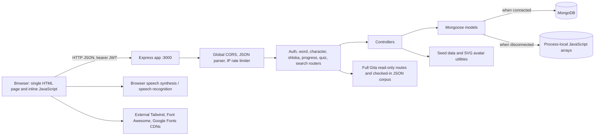

# Mahabharat Study Engine — Project Reference

**Repository:** `mahabharat-spaced-repetition`  
**Version declared in `package.json`:** 1.0.0  
**Documented from source:** 2026-09-28  
**Scope:** The current repository, not a proposed future architecture. This is a Node.js web application with two server-rendered HTML pages, browser-side JavaScript, a JSON API, a checked-in Gita corpus, and MongoDB or an ephemeral JavaScript store.

## 1. Purpose and user journeys

The application helps learners explore Mahabharat and Bhagavad Gita vocabulary, verses, and characters. A learner can create an account or enter as a guest, search vocabulary, rate recall from 0 to 5, view study statistics, read verses in English, Hindi, or Bengali, use browser speech features, compare characters in a simulated arena, and take a five-question vocabulary quiz. Administrators can manage words, verses, and characters through protected API endpoints. There is no separate admin UI in this repository.

The main UI contains five tabs: Dashboard, Vocabulary Guide, Bhagavad Gita Verses, Epic Characters, and Interactive Quiz. Authentication screens are served in the same page. A separate **Full Bhagavad Gita** reader is available at `/full-bhagavad-gita` and linked from the main app. Its source-based text is separate from the main app's generated verse collection. Search history and quiz history have APIs; the page displays recent searches and quiz results, but does not expose every API feature as a screen.

## 2. Repository map

| Path | Responsibility |
| --- | --- |
| `src/app.ts` | Express bootstrap, middleware and routes, plus the entire HTML/CSS/JavaScript UI returned by `GET /`. |
| `src/modules/fullGita/` | Separate full-text reader page, read-only JSON API, and normalized 18-chapter source snapshot. |
| `scripts/import-full-gita.mjs` | Validates and regenerates the source snapshot from upstream JSON files. |
| `tests/full-gita.test.mjs` | Checks corpus coverage and landmark verses. |
| `src/routes/` | Seven core Express routers defining endpoint paths and access middleware; the eighth reader router is under `src/modules/fullGita/`. |
| `src/controllers/` | Request handling, queries, authentication, quiz grading, and SM-2 review calculations. |
| `src/models/` | Seven Mongoose schemas and TypeScript document interfaces. |
| `src/config/db.ts` | MongoDB connection, fallback selection, and seed check. |
| `src/config/inMemoryDb.ts` | Monkey-patched Mongoose model methods backed by process-local arrays. |
| `src/middlewares/` | JWT authentication, role checks, rate limiting, and error handler. |
| `src/utils/` | Seed generators, SVG avatars, and basic auth input validation. |
| `.env.example` | Environment variable names and sample values; contains credential-like examples. |
| `metadata.json` | Product metadata and capability declarations. |
| `docs/code_review.md` | Older review report; several assertions differ from the current source. |
| `package.json`, `package-lock.json`, `bun.lock`, `tsconfig.json` | Scripts, dependency manifests, and TypeScript settings. `bun.lock` is empty. |

The Full Gita corpus has focused automated tests. No CI workflow, container configuration, or deployment manifest is present in this repository.

## 3. Architecture



**Request flow.** `src/app.ts` loads environment variables with `dotenv.config()`, creates Express, enables unrestricted `cors()` and JSON parsing, installs a process-local rate limiter, calls `connectDB()` without awaiting it, mounts eight routers, serves the main page at `/` and the separate reader at `/full-bhagavad-gita`, installs the error handler, and listens on hard-coded port **3000**. Requests can arrive while the database connection and seeding are still running.

**Storage choice.** `connectDB()` attempts `MONGODB_URI` with a 3-second server selection timeout. If it is absent, equals `123`, or fails, the app activates the JavaScript array fallback. `inMemoryDb.ts` patches selected Mongoose static methods and chooses MongoDB only when `mongoose.connection.readyState === 1`. The fallback is neither `mongodb-memory-server` nor persistent storage; its data vanishes on process restart and is isolated per server process. The `mongodb-memory-server` dependency is imported in `db.ts`, but no memory server is started.

**Seeding.** After connection/fallback selection, `checkAndSeed()` checks word count, character count, user count, and whether a character lacks an avatar. If words are fewer than 30, characters or users are absent, or a character has no avatar, `seedDatabase()` deletes **all seven collections** and recreates demo users and study content. This also deletes user progress, quiz history, and search history. The seed check is therefore unsafe for a database that contains real user data. Seed errors are caught and logged by `checkAndSeed()` without stopping the HTTP server.

**Client design.** The root page is a large template string in `app.ts`; client state and event handlers are inline JavaScript. Calls use relative `/api/...` URLs. The JWT is stored in browser `localStorage` and added to protected requests as an `Authorization: Bearer` header. Login/register/guest responses also set an HTTP-only `token` cookie; the authentication middleware accepts either source. The page's logout handler removes the local token but does not call the server's `/api/auth/logout`, so the cookie can remain valid. A remembered username is also stored in `localStorage`.

**Full Gita reader.** `src/modules/fullGita/page.ts` serves a standalone responsive page. `src/modules/fullGita/routes.ts` reads checked-in JSON snapshots and needs no database connection, account, or API key. It supports search, chapter/verse navigation, attributed English/Hindi translation selection, 701 clearly labeled machine-assisted Bangla study meanings, Bengali-script Sanskrit, comparison of all seven source translations, word meanings, browser speech synthesis, optional locally served devotional audio with play/mute/volume controls, local bookmarks, and verse deep links. The generated Krishna scholar artwork in `src/assets/krishna-scholar-artist.webp` appears in this reader and the main app's Gita tab. Bangla speech requires an installed Bengali browser/system voice. See [FULL_GITA.md](FULL_GITA.md) for provenance, limits, audio credits, and update steps.

## 4. Complete technology stack

| Layer | Technology and use |
| --- | --- |
| Language/runtime | TypeScript targeting ES2022, CommonJS output; Node.js runtime. No Node version pin is declared. |
| Server/API | Express 4.19.2; `cors` 2.8.5; `dotenv` 16.4.5. |
| Data | Mongoose 8.3.1 with MongoDB through `MONGODB_URI`; custom JavaScript array fallback. `mongodb-memory-server` 9.2.0 is declared but not actually started. |
| Identity | `bcryptjs` 2.4.3 for password hashes (cost 10); `jsonwebtoken` 9.0.2 for signed JWTs; custom authentication and role middleware. |
| Browser UI | Server-sent HTML, inline JavaScript and CSS, Tailwind CSS CDN runtime, Font Awesome 6.4.0 CDN, Google Fonts (Cinzel, Lora, Plus Jakarta Sans). No React/Vue or bundler. |
| Browser media | Web Speech API: `speechSynthesis` for verse/quiz audio and `SpeechRecognition`/`webkitSpeechRecognition` for verse voice search, where supported. |
| Development/build | `ts-node` 10.9.2, `ts-node-dev` 2.0.0, TypeScript 5.4.5, npm scripts; `tsc` emits `dist/`. `npm start` executes the source via `ts-node`, not the compiled output. |
| Type packages | `@types/node` 20.12.7, `@types/express` 4.17.21, `@types/cors` 2.8.17, `@types/bcryptjs` 2.4.6, `@types/jsonwebtoken` 9.0.6. |

Versions above are dependency ranges declared in `package.json`; actual installed versions depend on the lockfile/install. `metadata.json` declares a server-side Gemini capability and microphone permission, but this codebase contains no Gemini SDK, Gemini API call, or Gemini environment variable.

## 5. Low-level design

### 5.1 Domain model and relations

All seven Mongoose schemas use `timestamps: true`; collection names are Mongoose-derived. IDs are MongoDB ObjectIds when using MongoDB. The array fallback creates ObjectIds but does not fully reproduce Mongoose validation, uniqueness, or query semantics.

| Model | Main fields and relationships | Validation/index notes |
| --- | --- | --- |
| `User` | `username`, optional bcrypt `password`, `fullName`, role (`admin`, `student`, `guest`), `streak`, `lastActive`. | Username is required and `unique`; role defaults to `student`. Guest records have no password. |
| `Word` | Sanskrit term stored as `arabic`, `transliteration`, `translation`, `rootWord`, `meaning`, `difficulty`, `occurrences`, `grammarSegment`, `examples[]`. | Difficulty enum is easy/medium/hard. Virtual `sanskrit` aliases `arabic`. Example's `sanskritText`, `chapter`, `verse` virtually alias `arabicText`, `surah`, `ayah`; these are legacy field names. |
| `Character` | `name`, `alliance`, `role`, `description`, `keyAttributes[]`, `weapons[]`, `avatar`, `image`. | List/detail handlers replace missing or remote image URLs with a generated SVG data URI. |
| `Shloka` | `chapter`, `verse`, `chapterName`, Sanskrit, transliteration, English/Hindi/Bengali translation and explanation. | Hindi/Bengali fields default to empty strings. No unique `(chapter, verse)` index is declared. |
| `Progress` | `userId → User`, `wordId → Word`, `interval`, `repetition`, `easeFactor`, `nextReviewDate`. | Defaults: 1 day, 0 repetitions, ease 2.5, review date now. No unique `(userId, wordId)` index. |
| `QuizHistory` | `userId → User`, `score`, `totalQuestions`, embedded question details (`wordId`, word, answer, correct answer, correctness). | History endpoint returns latest 10. |
| `SearchHistory` | `userId → User`, `query`. | Saves a search unless it equals the most recent query case-insensitively; history endpoint returns latest 10. |

### 5.2 API contract

All API endpoints return JSON; `GET /` and `GET /full-bhagavad-gita` return HTML. A `401` means no usable identity was provided; a `403` is returned for an invalid/expired JWT or insufficient role. Controller errors commonly return `{ "error": "..." }` with status 500. “Auth” means a valid bearer token or `token` cookie. “Admin” means Auth plus `role: admin` in the signed JWT.

| Method/path | Access | Input → output/behavior |
| --- | --- | --- |
| `GET /` | Public | HTML application. |
| `GET /full-bhagavad-gita` | Public | Standalone source-based Gita reader. |
| `POST /api/auth/register` | Public | `username`, `password`, `fullName` → user + JWT, status 201. Username ≥3, password ≥6, full name ≥2 characters. |
| `POST /api/auth/login` | Public | `username`, `password` → user + JWT; accepts username or matching full name. Updates login streak. |
| `POST /api/auth/login-guest` | Public | Creates a guest user; returns user + JWT. |
| `POST /api/auth/forgot-password` | Public | `username`, `newPassword`, `confirmPassword` → changes the named account's password. No ownership proof or reset token is required. |
| `POST /api/auth/logout` | Public | Clears the `token` cookie only. JWTs already issued remain valid until expiry. |
| `GET /api/auth/me` | Auth | Current user summary. |
| `GET /api/words` | Public | `page` (default 1), `limit` (default 15), `search`, `difficulty` → `{ words, pagination }`. Search matches five fields. |
| `GET /api/words/:id` | Public | One word or 404. |
| `POST /api/words`; `PUT /api/words/:id`; `DELETE /api/words/:id` | Admin | Create, replace/update, or delete a word. Request body is passed to the model directly. |
| `GET /api/characters` | Public | Optional `search`, `alliance` → array with normalized SVG image URLs. |
| `GET /api/characters/:id` | Public | One character or 404. |
| `POST /api/characters`; `PUT /api/characters/:id`; `DELETE /api/characters/:id` | Admin | Character CRUD. |
| `GET /api/shlokas` | Public | Optional `chapter`, `search` → all matching verses, without pagination. |
| `GET /api/shlokas/:id` | Public | One verse or 404. |
| `POST /api/shlokas`; `PUT /api/shlokas/:id`; `DELETE /api/shlokas/:id` | Admin | Verse CRUD. |
| `GET /api/progress` | Auth | All user's progress with populated words. |
| `GET /api/progress/queue` | Auth | `{ dueReviews, unreviewedWords }`; due date is `<= now`. |
| `POST /api/progress/review` | Auth | `wordId`, `rating` 0–5 → updated interval, repetition, ease, next date. |
| `GET /api/progress/stats` | Auth | Counts of total, reviewed, due, mastered, learning, and unreviewed words. Mastered means repetition ≥4. |
| `GET /api/quiz/generate` | Public | Samples up to five words and 15 distractors → questions with choices **and `correctAnswer`**. Requires at least four sampled words. |
| `POST /api/quiz/submit` | Auth | `answers: [{ wordId, answer }]` → server-graded score, detail list, saved history. |
| `GET /api/quiz/history` | Auth | Latest 10 quiz records. |
| `GET /api/search-history` | Auth | Latest 10 searches. |
| `POST /api/search-history` | Auth | `{ query }` → save nonempty query if different from last. |
| `DELETE /api/search-history` | Auth | Delete the user's search records. |
| `GET /api/full-gita/meta`; `GET /api/full-gita/chapters` | Public | Source/count metadata or chapter metadata. |
| `GET /api/full-gita/chapters/:chapter`; `GET /api/full-gita/verses/:chapter/:verse` | Public | Complete source-based chapter or single verse with attributed translations. |
| `GET /api/full-gita/search?q=...` | Public | Case-insensitive corpus search, limited to 60 previews. |

Search text is regex-escaped in word, character, and shloka controllers before querying. The word endpoint's page/limit and several mutation payloads have little validation. The quiz generator does not guarantee three distinct distractors for every word. Quiz submission resolves each supplied `wordId` against the database; it does not bind answers to a previously generated quiz.

### 5.3 Spaced repetition calculation

`POST /api/progress/review` loads or creates a `(userId, wordId)` progress record and applies this SM-2-style calculation:

1. Accept a recall quality `q` from 0 to 5.
2. If `q < 3`, set repetitions to 0 and interval to 1 day.
3. Otherwise, use 1 day for the first successful review, 6 days for the second, and `round(previous interval × previous ease factor)` thereafter; increment repetitions.
4. Update ease factor as `max(1.3, oldEase + 0.1 - (5-q) × (0.08 + (5-q) × 0.02))`.
5. Set `nextReviewDate` to current server time plus the interval in calendar days, then save.

There is no background scheduler. The queue endpoint computes what is due when called, and the UI records a review when a learner rates a word. The current rating check does not enforce integer or numeric type, and `wordId` is not explicitly checked for existence before a new progress record is saved.

### 5.4 Seed content and provenance limits

| Dataset | Current generation |
| --- | --- |
| Vocabulary | Exactly **520** seed records. A small authored base/extended list is expanded in a loop to 520 with repeated concepts, synthetic suffixes, and generated example text. The count is a record count, not 520 independently verified terms. |
| Characters | **50** raw seed characters. The seed export replaces source image URLs with generated SVG data URIs. |
| Gita verses | **701** records across **18** chapter counts, despite the UI's “700” label. **11** keyed landmark verses have individually written Sanskrit and translations. The remaining **690** use repeated placeholder Sanskrit/transliteration and template translations/explanations with chapter/verse labels. Do not treat the records as a verified complete text. |
| Full Gita reader | Separate upstream source snapshot: **701** unique numbered Sanskrit verses, 18 chapters, and **4,907** author-attributed English/Hindi translations, plus 701 machine-assisted Bangla study meanings in a separate snapshot. Chapter 13 has 35 numbered verses in this edition. This is the reader's content, not the generated `/api/shlokas` data. |
| Demo users | Seeder creates an admin and a student account with hard-coded example passwords. See the security section before any public deployment. |

The character comparison arena is a deterministic **browser-only simulation**. It uses hard-coded or derived valour, astra, intellect, and dharma scores; weights them 25%, 30%, 20%, and 25%; and favors the higher weighted score. The displayed percentage is a normalized score, not a measured win probability. Arena results are not stored.

## 6. Environment variables and secrets

| Name | Used by code? | Meaning and effective default |
| --- | --- | --- |
| `MONGODB_URI` | Yes | MongoDB connection URI. Missing, `123`, or failed connection selects the ephemeral JavaScript fallback. Treat a real URI as a secret. |
| `JWT_SECRET` | Yes | Primary JWT signing and verification secret. Highest priority. Must be a strong random value and the same across server instances. |
| `JWT_ACCESS_SECRET` | Yes, fallback | Used for JWTs only when `JWT_SECRET` is unset. This is not a separate token type in the current code. |
| `JWT_ACCESS_EXPIRY` | Yes | JWT `expiresIn` value; defaults to `1d`. The example file suggests `15m`. |
| `NODE_ENV` | Yes | `production` sets Secure on auth cookies; `development` includes error stacks in global error responses. No project-specific default. |
| `PORT` | **No** | Listed in `.env.example`, but `src/app.ts` always listens on 3000. |
| `JWT_REFRESH_SECRET` | **No** | Listed in `.env.example`; no refresh-token flow exists. |

**Secret inventory and handling.** `.env.example` currently contains a credential-looking MongoDB URI and a fixed JWT signing value; The example file contains only placeholders. The JWT code keeps a local development fallback but refuses to sign or verify production tokens until `JWT_SECRET` (or the legacy `JWT_ACCESS_SECRET`) is configured. Demo accounts and their one-click login controls are disabled in production. Local demo credentials are still visible in source and must never be reused as real credentials. A local `.env` is ignored by `.gitignore`; keep production secrets in the deployment platform's secret store. No Gemini API key is referenced by the code.

For a local persistent setup, supply at least a valid `MONGODB_URI` and strong `JWT_SECRET` in a private `.env`. `JWT_ACCESS_EXPIRY` and `NODE_ENV` are optional operational settings. `PORT` currently cannot override the listener.

## 7. Run and build

```bash
npm ci
# Create a private .env with MONGODB_URI and JWT_SECRET before relying on persistence.
npm run dev      # ts-node-dev, reloads during development
npm run lint     # TypeScript check only: tsc --noEmit
npm run build    # compile src/ to dist/
npm run test:full-gita # verify imported corpus coverage
npm start        # ts-node src/app.ts, listens on http://localhost:3000
```

If no usable MongoDB URI is configured, the app runs with process-local data and reseeds it on each new process. The seed logic may delete real data on a connected database, so a production startup needs a safe migration/seed policy before use. The root UI needs network access to external CSS, icon, and font CDNs for its intended appearance.

## 8. Current risks and implementation gaps

These are observations from the current code, not claims that the application has passed a security or production review.

1. **Critical account takeover:** `POST /api/auth/forgot-password` resets any registered account using only its username and a new password. It requires identity verification or a signed, expiring reset flow.
2. **Credential exposure:** Example MongoDB/JWT values, hard-coded JWT fallback, and seeded demo passwords are unsuitable for a public deployment. The seeder can recreate known admin credentials.
3. **Destructive startup:** A low word count, missing user/character, or missing avatar purges all user and learning collections. Separate one-time migrations/content seeding from production boot.
4. **Ephemeral fallback:** MongoDB failures silently switch to per-process arrays. Data is lost at restart and differs across replicas; the UI labels any successful word request as a connected database.
5. **Browser injection/session risk:** Multiple API values are interpolated into `innerHTML` and inline event attributes without escaping; the JWT is stored in `localStorage`. Malicious persisted content could execute script and obtain the token. The cookie path has no explicit `SameSite`/CSRF design.
6. **Quiz integrity:** Generated questions expose `correctAnswer`; submission does not prove that answers belong to a generated quiz. This is suitable for self-study, not trusted scoring.
7. **Input and scale:** Review ratings, IDs, pagination limits, search lengths, and admin mutation bodies need stronger validation. Full shloka lists and unreviewed word lists have no pagination. The IP limiter is a process-local 100-requests-per-minute counter, not shared across instances, and its map has no cleanup.
8. **Data fidelity:** Most main-app seeded verses and many vocabulary records are generated placeholders. The separate Full Gita reader uses the upstream source dataset, with its own numbering and author attributions. Verify underlying translation rights before broader publication.
9. **Missing verification and operations:** Only the Full Gita corpus has focused tests. No CI, health/readiness endpoint, structured logging, backup procedure, migration process, or deployment definition is present. `connectDB()` is not awaited before listening.

`docs/code_review.md` describes a `mongodb-memory-server` fallback and declares the project production-ready; the current `db.ts` instead uses the JavaScript array fallback, and the issues above remain. Use this document and the source files as the current behavioral reference.
